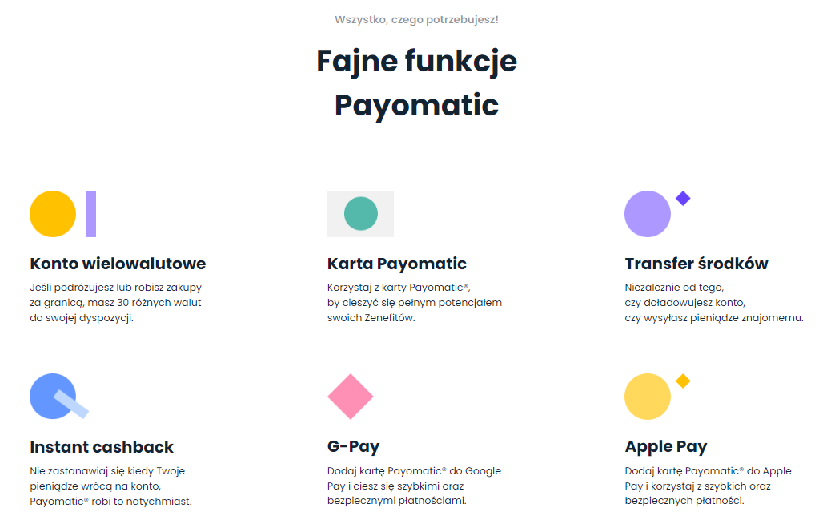
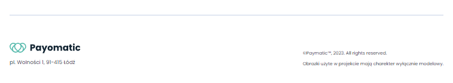
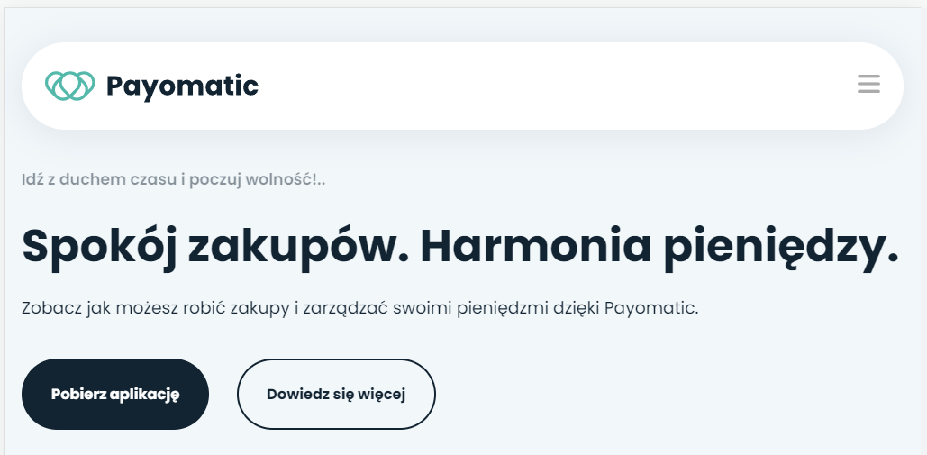
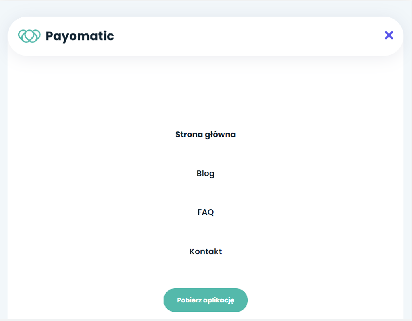

# Payomatic Card App

### Design of the layout of the payment card application.

## The goal of the project

It is an example of an application layout that uses a payment card.
Used SCSS variables, mixins and BEM methodology.
It is an application that consolidates the scope of the material from the online course workshop.

## Technologies Used:

- HTML5,
- SASS preprocessor (SCSS),
- JavaScript,
- Git Bush,
- Git,

## Tools:

- Node.js,
- NPM & dependences,
- Gulp.js & extensions,
- AOS (Animate On Scroll library),
- VSC (Visual Studio Code),
- Netlify

## Setup:

To run this project, start it in root directory using:
'npm run dev'

## Screenshots

Example screenshots:

## Features

- Gulp configuration,
- SCSS styling & variables,
- Nesting of selectors,
- Partials and modules in SCSS,
- Mixins and extending,
- Use of BEM methodology,
- Even More.
